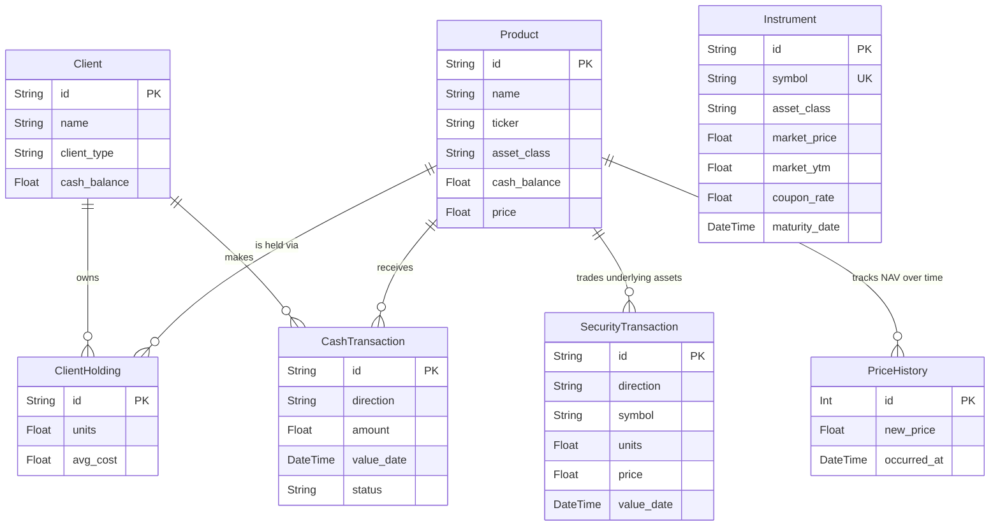
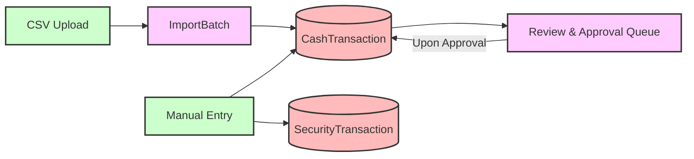
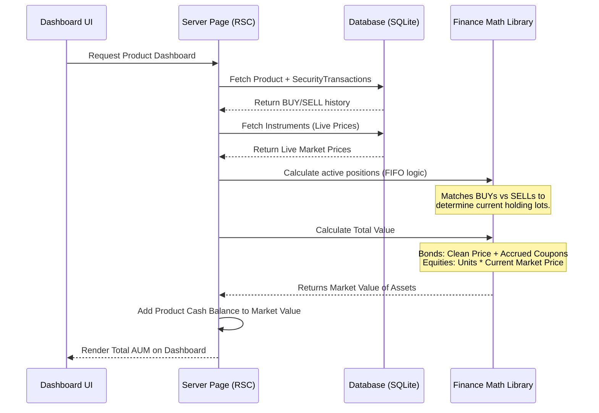

# FundManager 🚀

FundManager is a comprehensive, modern web application designed for asset and wealth management. It provides tools for tracking portfolios, managing transactions across different asset classes (Equities, Fixed Income, Money Market), integrating live market data, and computing complex financial metrics like Yield to Maturity (YTM) and Net Asset Value (NAV).

---

## 🌟 Key Features

- **Multi-Asset Portfolio Management**: Support for Global/Local Equities, Bonds, Treasury Bills, Real Estate, and Alternatives.
- **Dynamic AUM Calculation**: Total Assets Under Management is computed dynamically using real-time market prices and historical transaction data using FIFO (First-In-First-Out) methodology.
- **Live Market Data Integration**: 
  - Yahoo Finance API for real-time global equity pricing.
  - Google Sheets integration for synchronized Bond and T-Bill pricing.
- **Transaction Processing**: Batch processing of Cash and Security transactions via CSV upload or manual entry.
- **Advanced Financial Math**: In-built modules for calculating accrued interest, clean/dirty prices, Yield to Maturity (YTM), and amortized cost (Book Value).
- **Historical Performance Tracking**: Reconstructs portfolio history day-by-day to generate accurate NAV trajectories and historical AUM charts.

---

## 🛠️ Technology Stack

- **Framework**: [Next.js 15](https://nextjs.org/) (App Router)
- **Language**: [TypeScript](https://www.typescriptlang.org/)
- **Database**: SQLite (via [Prisma ORM](https://www.prisma.io/))
- **Styling**: [Tailwind CSS v4](https://tailwindcss.com/) & [shadcn/ui](https://ui.shadcn.com/)
- **Authentication**: [NextAuth.js](https://next-auth.js.org/)
- **Charts**: [Recharts](https://recharts.org/)
- **Data Parsing**: PapaParse (CSV), xlsx (Excel)

---

## 🏗️ Database Architecture (ERD)

The system is built on a relational database using Prisma. Below is the Entity-Relationship Diagram outlining the core business logic models.



---

## 🔄 System Data Flows

FundManager relies on distinct data pipelines to ensure accuracy and real-time reflection of the fund's status.

### A. Market Data Ingestion Pipeline
Market data updates the `Instrument` prices (Bonds/T-Bills) and `Product` unit prices (Equities).

```mermaid
flowchart TD
    %% Sources
    GS[Google Sheet (Fixed Income)]:::source
    YF[Yahoo Finance API (Equities)]:::source
    FCMB[Manual Data Override]:::source

    %% Processors
    SA[Server Action: updateMarketPrices]:::processor

    %% DB Storage
    DB_Inst[(DB: Instrument)]:::db
    DB_Prod[(DB: Product)]:::db
    DB_Hist[(DB: PriceHistory)]:::db

    %% Connections
    GS -->|Parses Bond/T-Bill Prices & YTM| SA
    YF -->|Fetches Global Equity Prices| SA
    FCMB -->|Manual Price Overrides| SA

    SA -->|Updates Market Price| DB_Inst
    SA -->|Updates NAV Price| DB_Prod
    SA -->|Logs Price Event| DB_Hist

    classDef source fill:#f9f,stroke:#333,stroke-width:2px;
    classDef processor fill:#bbf,stroke:#333,stroke-width:2px;
    classDef db fill:#fbb,stroke:#333,stroke-width:2px;
```

### B. Transaction Management Pipeline
Cash and security transactions dictate the holdings of a product or client.



### C. AUM & Dashboard Aggregation
When rendering a dashboard, the system dynamically reconstructs the portfolio's state by merging historical transactions with live pricing data.



---

## 🧠 Key Architectural Principles

1. **Calculated vs. Stored State**: Total AUM and NAV are **never directly stored** as static fields. They are dynamically calculated on the fly by combining `SecurityTransactions` (quantity of assets) with `Instruments` (live value). 
2. **Cash Balances Separation**: Cash flows are strictly separated. Current AUM uses the `product.cash_balance` field, whereas historical AUM charts dynamically compute cash based on `CashTransaction` inflows/outflows over time.
3. **Historical Snapshots vs Replay**: For intense charts (like Equities), calculating historical prices dynamically for every day is computationally heavy. The system uses a hybrid approach:
   - Tracks **Book Value AUM** (Amortized Cost) dynamically by replaying transactions up to a specific date.
   - Utilizes a `PriceHistory` database table for daily snapshotting of the true **Market AUM** via a scheduled Cron Job.

---

## 🚀 Setup and Installation

### Prerequisites
- Node.js (v18+)
- `npm` or `bun`

### Installation Steps

1. **Clone the repository**
   ```bash
   git clone <repository-url>
   cd fundmanager-v01
   ```

2. **Install dependencies**
   ```bash
   npm install
   # or
   bun install
   ```

3. **Set up Environment Variables**
   Create a `.env` file in the root directory:
   ```env
   DATABASE_URL="file:./prisma/dev.db"
   NEXTAUTH_SECRET="your_secret_here"
   NEXTAUTH_URL="http://localhost:3000"
   # Add your Google Sheets API / Yahoo Finance API keys if applicable
   ```

4. **Initialize Database**
   ```bash
   npx prisma generate
   npx prisma db push
   ```

5. **Run the Development Server**
   ```bash
   npm run dev
   # or
   bun run dev
   ```

Open [http://localhost:3000](http://localhost:3000) with your browser to see the result.

---

## 📜 Useful Scripts

- `npm run repopulate:gif`: Repopulates the Global Income Fund data (found in `/scripts`).
- `npm run update-prices`: Manually triggers a pull from Google Sheets to update fixed-income prices.
- The `scripts/` folder contains various database seeding and manipulation scripts used for initial setup or migrations.

---

*FundManager was architected to handle complex financial workflows with an emphasis on accuracy, performance, and clear data lineage.*
