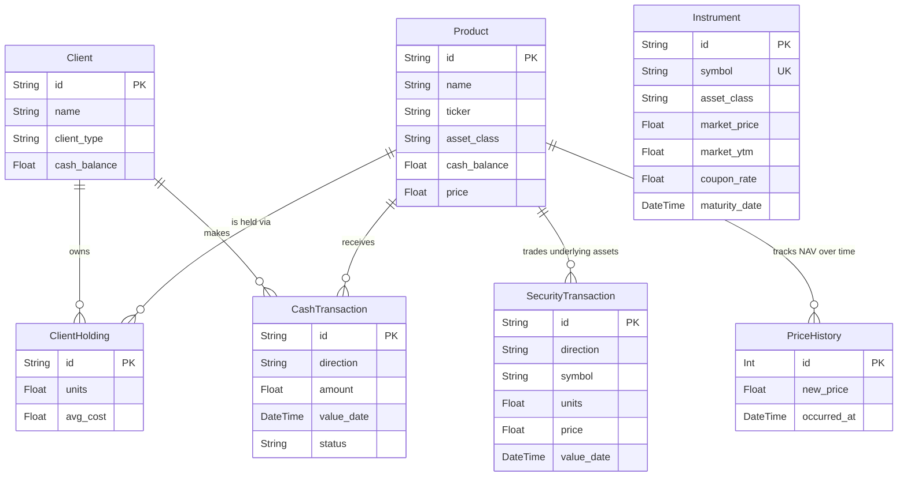
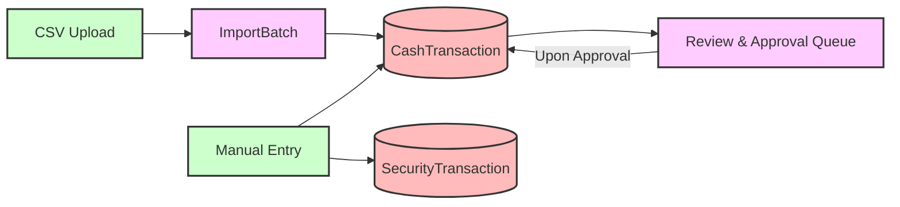
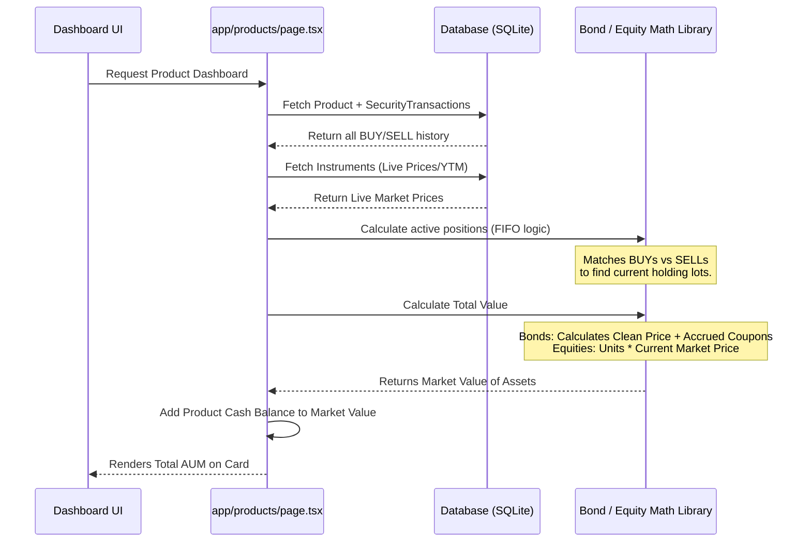

# Database Architecture & Data Flows

This document outlines the core database schema for FundManager and illustrates how data flows through the application from external sources (Google Sheets, Yahoo Finance) to the user interfaces.

## 1. Entity Relationship Diagram (ERD)

The system relies on Prisma with an SQLite database. Below is the core architectural diagram of the business logic models. (Auth and Config models are excluded for simplicity).



---

## 2. Data Flow: How Data Enters & Exits the System

There are several distinct data pipelines that feed into the database and are eventually aggregated to calculate metrics like Total AUM and NAV.

### A. Market Data Ingestion Pipeline
Market data updates the `Instrument` prices (Bonds/T-Bills) and `Product` unit prices (Equities). This is triggered by the "Update Market Prices" button, which fires the `updateMarketPricesFromSheet` and `applyPricesAction` server actions.

```mermaid
flowchart TD
    %% Sources
    GS[Google Sheet (FBNUK / T-Bills Tabs)]:::source
    YF[Yahoo Finance API]:::source
    FCMB[FCMB Data Override]:::source

    %% Processors
    SA[Server Action: updateMarketPricesFromSheet]:::processor

    %% DB Storage
    DB_Inst[(DB: Instrument)]:::db
    DB_Prod[(DB: Product)]:::db
    DB_Hist[(DB: PriceHistory)]:::db

    %% Connections
    GS -->|Parses Bond/T-Bill Prices & YTM| SA
    YF -->|Fetches Global Equity Prices| SA
    FCMB -->|Manual Price Overrides| SA

    SA -->|Updates Market Price| DB_Inst
    SA -->|Updates NAV Price| DB_Prod
    SA -->|Logs Price Event| DB_Hist

    classDef source fill:#f9f,stroke:#333,stroke-width:2px;
    classDef processor fill:#bbf,stroke:#333,stroke-width:2px;
    classDef db fill:#fbb,stroke:#333,stroke-width:2px;
```

### B. Transaction Management Pipeline (Money In/Out)
Cash and security transactions define what a product or client holds. They are either inputted manually or imported via CSV batches.



### C. AUM & Dashboard Aggregation (Data Out)
When you load the product dashboard, the system doesn't just read a single "AUM" database field. It dynamically reconstructs the fund's portfolio by calculating the active inventory from transactions and applying the latest live market data.



## Key Architectural Takeaways

1. **Calculated vs. Stored State:** Total AUM is **never directly stored** in the database. It is dynamically calculated on the fly by combining `SecurityTransactions` (which define the quantity of assets held) with `Instruments` (which define the current live value of those assets). 
2. **Cash Balances:** Cash flows are highly separated. For bond funds, the cash displayed in the AUM is drawn strictly from the `product.cash_balance` field, whereas historical AUM charts dynamically compute cash based on `CashTransaction` inflows and outflows over time.
3. **Historical Charts:** The AUM chart relies on replaying all historical `SecurityTransaction` and `CashTransaction` events chronologically, generating a daily snapshot of the fund's value (`generateHistoricalAUM`). It relies on `PriceHistory` only as a secondary fallback.
